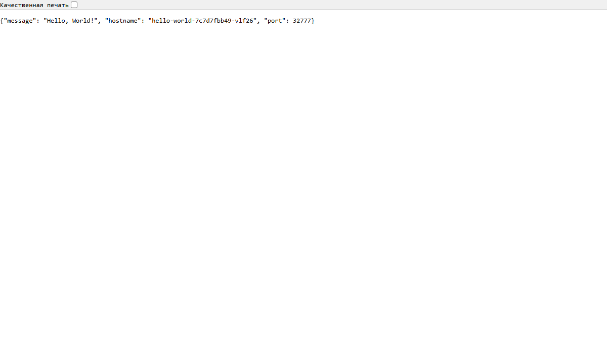
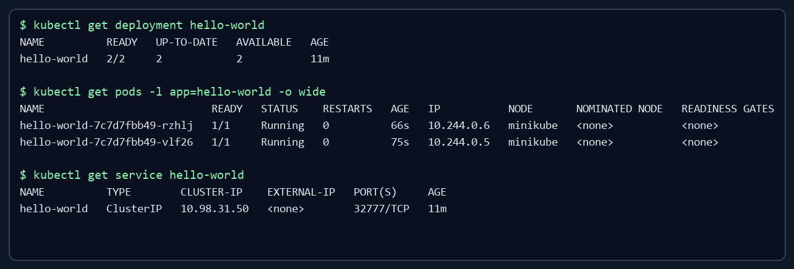

# Hello World DevOps

Тестовое задание: HTTP-приложение на порту `32777`, контейнер Docker и развёртывание в Minikube с двумя репликами.

- GitHub: <https://github.com/aoswhiskey/hello-world-devops>
- Docker Hub: <https://hub.docker.com/r/aoswhiskey/hello-world-devops>

## Что входит в проект

- `app.py` — HTTP API без сторонних зависимостей;
- `Dockerfile` — образ с непривилегированным пользователем и healthcheck;
- `k8s/deployment.yaml` — Deployment с двумя репликами и probes;
- `k8s/service.yaml` — ClusterIP Service на порту `32777`;
- `diagram.drawio` — редактируемая схема контейнеров и сервиса;
- `screenshots` — подтверждения запуска после выполнения команд.

## Локальная проверка

```powershell
python -m unittest -v
python app.py
```

Открыть <http://127.0.0.1:32777>. Проверка состояния: <http://127.0.0.1:32777/healthz>.

## Docker

```powershell
docker pull aoswhiskey/hello-world-devops:1.0.0
docker run --rm -p 32777:32777 aoswhiskey/hello-world-devops:1.0.0
```

Сборка и публикация новой версии:

```powershell
docker build -t aoswhiskey/hello-world-devops:1.0.0 .
docker push aoswhiskey/hello-world-devops:1.0.0
```

## Minikube

Для Windows с Docker Desktop:

```powershell
minikube start --driver=docker
kubectl apply -f k8s/deployment.yaml
kubectl apply -f k8s/service.yaml
kubectl rollout status deployment/hello-world --timeout=120s
kubectl get pods -l app=hello-world -o wide
kubectl get service hello-world
```

Проброс порта (команда должна оставаться запущенной):

```powershell
kubectl port-forward service/hello-world 32777:32777
```

После этого открыть <http://127.0.0.1:32777>. Команда `kubectl port-forward service/...` выбирает один из Pod для туннеля; наличие двух готовых реплик проверяется через `kubectl get deployment,pods`.

## Подтверждение результата





## Удаление ресурсов

```powershell
kubectl delete -f k8s/service.yaml
kubectl delete -f k8s/deployment.yaml
minikube stop
```
